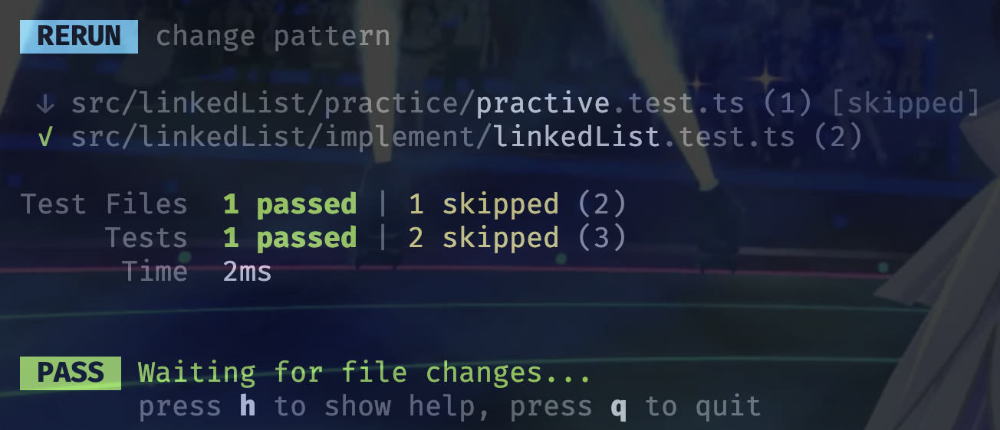
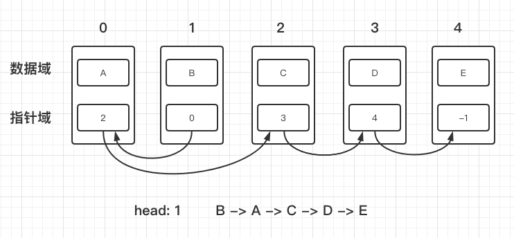
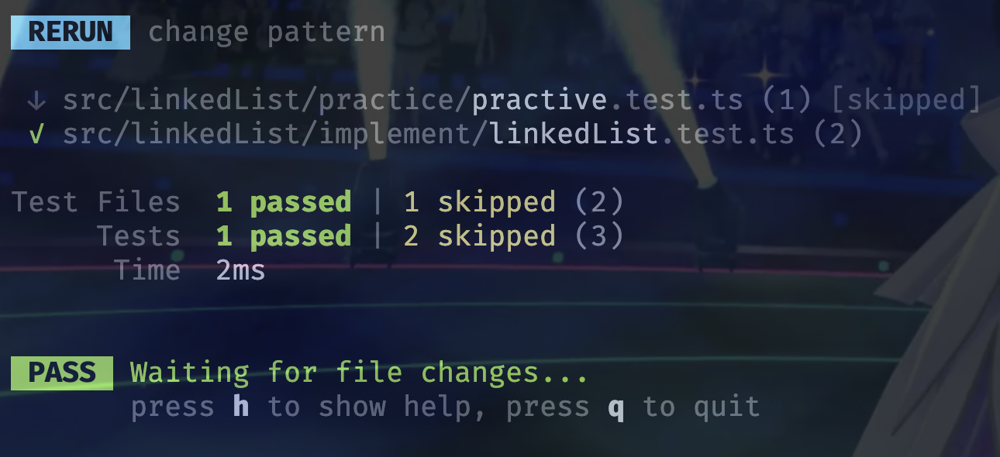
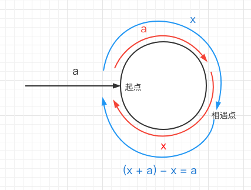
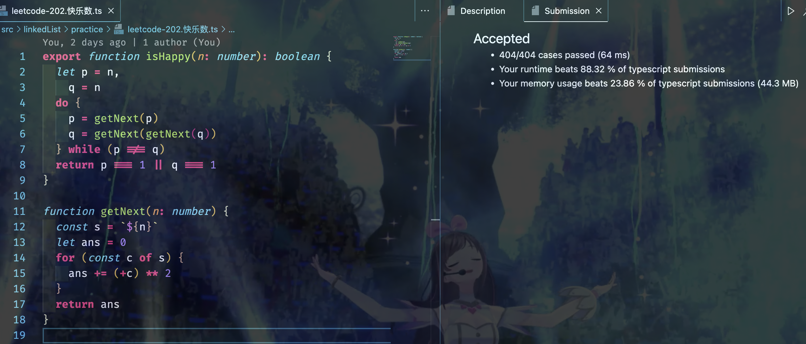

## 链表在前端中的应用

在 React 中，Fiber 树的 CRUD 操作都是链表的操作，因此要掌握其 diff 算法，掌握链表的操作是必要的。


## 链表的实现

链表节点有两部分组成，`数据域` 和 `指针域`。

无论用什么方式实现，只要把这两部分都完成好就算是实现一个链表了。

> #### 对象形式

```ts
type LinkedNode = {
  value: number
  next: LinkedNode | null
}

class Node {
  public head: LinkedNode | null = null
  public currentInd: LinkedNode | null = null
  
  constructor(value: LinkedNode['value']) {
    this.head = { value, next: null }
    this.currentInd = this.head
  }
  
  setNext(value: LinkedNode['value']) {
    this.currentInd!.next = { value, next: null }
    this.currentInd = this.currentInd!.next
    return this
  }
  
  getLinkedNode() {
    return this.head
  }
}

export function constructLinkedList(value: LinkedNode['value']) {
  return new Node(value)
}
```

用对象方式实现链表，数据域和指针域可以通过对象属性来实现。

接下来测试一下这个链表的实现有没有问题。

```ts
import { describe, expect, test } from 'vitest'
import { constructLinkedList } from './linkedList'

describe('linkedList'. () => {
  test('object based linkedList', () => {
    const l = constructLinkedNode(1).setNext(2).setNext(3).setNext(4).setNext(5)
    let head = l.getLinkedNode()

    let i = 1
    while (head?.value) {
      expect(head.value).toBe(i++)
      head = head.next
    }
  })
})
```



> #### 数组形式



```ts
const values: Array<number | null> = Array.from(new Array(10), _ => null)
const nextNode: Array<number> = Array.from(new Array(10), _ => -1)
let head: number, cur: number

export function constructLinkedNodeByArr(value: number, next: number) {
  head = cur = next
  setNode(value, next)
  return { values, nextNode, head }
}

export function setNode(value: number, next: number) {
  nextNode[cur] = next
  cur = next
  values[cur] = value
}
```

再测试一下这种方式的实现是否成功。

```ts
import { describe, expect, test } from 'vitest'
import {
  constructLinkedNodeByArr,
  setNode,
} from './linkedList'

describe('linkedList', () => {
  test('array based linked list', () => {
    const { values, nextNode, head } = constructLinkedNode2(1, 1)
    setNode(2, 3)
    setNode(3, 2)
    setNode(4, 6)
    setNode(5, 5)

    let cur = head,
      i = 1
    while (values[cur]) {
      expect(values[cur]).toBe(i++)
      cur = nextNode[cur]
    }
  })
})

```




## 练习

### 闭环

> #### leetcode 141.环状链表

这道题要求我们判断一个给定链表是否有环。

对于这道题有两种实现思路

* 使用一个指针和一个存储区，每次遍历的时候先判断当前指针指向节点是否在存储区中，如果有说明链表有环，如果没有则记录当前节点并继续遍历。如果遍历完整个链表，则说明当前链表无环。这种方法需要我们额外开拓一个存储区。
* 使用快慢指针，慢指针每次走一步，快指针每次走两步。如果链表有环，那快慢指针迟早会相遇；如果遍历完链表，说明链表没环。这种方法相比上一种能用更少内存来实现目标。

```ts
type ListNode = {
  val: number
  next: ListNode | null
}

function hasCycle(head: ListNode | null): boolean {
  if (!head?.next) return false
  let p: ListNode | null = head, q: ListNode | null = head
  do {
    p = p.next
    q = q.next.next
  } while (q?.next && p !== q)

  return p === q
}
```


> #### leetcode 142.环形链表II

这道题要求我们查找一个环形链表的起点，具体方法如下：

1. 先判断一个链表有没有环，实现方法使用快慢指针
2. 若有环，当快慢指针相遇时，让其中一个指针回到起点，然后两个指针每次走一步，再次相遇的节点即环形链表的起点

这个方法有效性的证明如下：



令在一个环形链表中，慢指针p和快指针q初始在链表头并且同时前进，慢指针p每次前进一步，快指针q每次前进两步；

令慢指针p走到链表起点需要走a步，此时快指针q走了2a步；

令此时快指针距离环起点还剩x步；

由于慢指针p每次走一步，快指针q每次走两步，因此它们要在环中相遇还需要走x步，相遇点即慢指针p从环起点继续走x步；

此时相遇点和环起点的距离为：( x + a ) - x = a；

因此，只要在相遇点，令其中一个指针回到链表头，再同时每次前进一步，再次相遇的节点即环起点。

```ts
type ListNode = {
  val: number
  next: ListNode | null
}

function detectCycle(head: ListNode | null): ListNode | null {
  if (!head?.next) return head
  let p: ListNode | null = head, q: ListNode | null = head
  do {
    p = p!.next
    q = q.next?.next ?? null
  } while (q?.next && p !== q)
    
  if (!q?.next) return null
  
  p = head
  while (p !== q) {
    p = p!.next
    q = q!.next
  }
  
  return p
}
```


> #### leetcode 202.快乐数

这道题目可以转换为链表的闭环问题，在给定范围内按照快乐数的计算定义，一个数字按照定义展开下去必定有环，其收敛性的证明可以参考这篇文章：[https://blog.csdn.net/qq_23997101/article/details/49047133](https://blog.csdn.net/qq_23997101/article/details/49047133)

```ts
function isHappy(n: number): boolean {
  let p = n, q = n
  do {
    p = getNext(p)
    q = getNext(getNext(q))
  } while (p !== q)
  return p === 1 || q === 1
}

function getNext(n: number) {
  let s = `${n}`, ans = 0
  for (const c of s) {
    ans += (+c) ** 2
  }
  return ans
}
```




### 反转

> #### leetcode 206.反转链表

反转问题可以用三指针遍历，也可以使用递归的方法

```ts
function reverseList(head: ListNode | null): ListNode | null {
  if (!head?.next) return head
  const tail = head.next, p = reverseList(head.next)
  head.next = tail!.next
  tail!.next = head
  return p
}
```

使用递归方法不能一步步展开去想，这样会事倍功半，比较理想的方法应该是赋予一个递归函数含义，并且根据这个含义进行操作。

比如对于上述代码，我们可以这样思考：

```
现在有一个递归方法 reverseList，它接收一个链表的头节点，并且能将该链表反转后返回链表的头节点，因此变量 p 接收的就是反转完成后的链表的头节点，直接返回即可；

在递归的每一次操作中，我们只关注反转前的”当前节点“和”当前节点的下一节点“，要反转两个节点的指向非常简单：
	1.将当前节点的 next 指向当前节点的下一节点的 next;
	2.将下一节点的 next 指向当前节点
```


